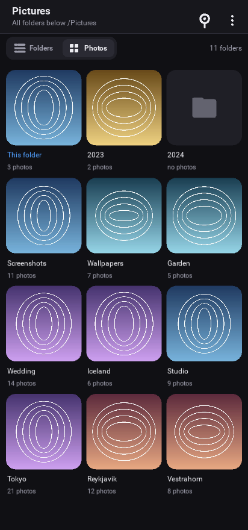

# OnePhoto

A Kivy app for Android that signs in to OneDrive and streams the pictures
stored there. It gives you your whole drive, lets you pin any folder as the
one the app opens on, and offers two ways to look at it.



## The two view modes

**Folders** — the classic layout. Subfolders and files of the current folder
as a list; tap a folder to open it, tap a picture to view it full screen.

**Photos** — photo-first. Every folder *and subfolder* underneath the current
one is flattened onto a single three-per-row grid of rounded square tiles.
The tiles show folders only, never their contents, each one covered by a
picture from inside it. Tapping a tile opens just that folder's own pictures —
its subfolders are not shown again, because they already have tiles of their
own on the grid.

Pictures sitting loose in the folder you are browsing have no subfolder of
their own, so they get a tile at the front of the grid labelled **This
folder**. Without it they would be unreachable in photo mode.

Switch between the modes with the toggle under the title bar. The choice is
remembered.

## Choosing the folder that opens on startup

Three ways, all writing the same setting:

* the pin button in the title bar pins whatever you are looking at now,
* **Settings → Startup folder** opens a folder picker,
* the ⋮ menu offers *Set as startup folder* and *Go to startup folder*.

## Setting up sign-in

People who install the app just tap **Sign in with Microsoft**, approve it in
their browser, and land on their OneDrive. That first screen shows nothing
else — no IDs, no configuration — as long as you build with a client ID of
your own. You register one free app, once:

1. Go to the [Azure portal → App registrations](https://portal.azure.com/#view/Microsoft_AAD_RegisteredApps/ApplicationsListBlade)
   and choose **New registration**.
2. Name it anything. For **Supported account types** pick *Accounts in any
   organizational directory and personal Microsoft accounts*.
3. Leave the Redirect URI empty on this form and register.
4. Open **Authentication → + Add a platform → Mobile and desktop
   applications** and tick
   `https://login.microsoftonline.com/common/oauth2/nativeclient`, then
   **Configure**. The device code flow never uses a redirect URI, but the
   endpoint that serves *personal* Microsoft accounts refuses to complete
   sign-in unless the registration has one on file — without it the browser
   step dies with `invalid_request: The provided request must include a
   'redirect_uri' input parameter`.
5. On that same **Authentication** page, scroll to **Advanced settings** and
   set **Allow public client flows** to **Yes**. Save.
6. Under **API permissions** add Microsoft Graph *delegated* permissions
   `Files.Read.All` and `User.Read`.
7. Copy the **Application (client) ID** from the overview page into
   `onephoto/app_id.py`:

   ```python
   DEFAULT_CLIENT_ID = "your-application-client-id"
   ```

Then build. That ID is an identifier, not a credential — public client apps
have no secret, so it is meant to ship inside the package. Everyone who
installs the app signs in with their own account, consents for themselves,
and their refresh token stays in private storage on their own device. You
never see their files.

On the desktop you can skip the edit and set `ONEPHOTO_CLIENT_ID` in the
environment instead. If a build has neither, the sign-in screen falls back to
asking for an ID — useful while developing, not something to ship.

### Who can sign in

* **Personal Microsoft accounts** — works as-is. One consent screen on first
  sign-in and they are through.
* **Work or school accounts** — usually works, but three things outside the
  app can stop it: tenants using the default risk-based step-up consent will
  want an admin to approve, because `Files.Read.All` is beyond the basic
  sign-in permissions and your registration is an unverified publisher; some
  tenants disable user consent entirely; and some Conditional Access policies
  block the device code flow specifically. Completing publisher verification
  on the registration addresses the first.

### What signing in looks like

The app uses the OAuth 2.0 device code flow, so there is no redirect URI, no
embedded web view and no client secret to leak. Tapping the button shows a
short code and opens Microsoft's device page in the system browser; the user
types the code, picks their account, and the app drops straight onto the main
screen. It is a few taps rather than a silent redirect, and it is the same
handshake the Azure CLI and smart TVs use. The token is refreshed
automatically afterwards, so this happens once per install.

One sharp edge worth knowing about, because it is invisible until it bites:
**personal and work accounts complete on different pages.** The `common`
authority sends everyone to `login.microsoft.com/device`, which is the Entra
page — a personal account that signs in there ends on *"You have reached the
wrong page"* and the app polls forever. The `consumers` authority returns
`microsoft.com/link` instead, which is where personal accounts actually
finish. So the app defaults to `consumers`, and the sign-in screen carries a
**Use a work or school account instead** button that switches to
`organizations` for the other case. Set `ONEPHOTO_TENANT` to override either
default when testing.

## Running it

On a desktop, for development:

```sh
python -m venv kivyenv && kivyenv/bin/pip install -r requirements.txt
ONEPHOTO_CLIENT_ID=your-application-client-id kivyenv/bin/python main.py
```

Building the Android package:

```sh
kivyenv/bin/pip install buildozer Cython   # Cython<3; p4a recipes need it
tools/build-apk.sh                         # APK lands in bin/
tools/build-apk.sh debug deploy run        # build, install and start on a device
```

Use the script rather than calling buildozer directly. p4a re-runs
`python -m venv venv` over its build venv at the start of every build, which
on the second and later runs re-seeds ensurepip's pip over whatever the last
run installed. The two releases are shaped differently — pip 25.3 ships
`build_env.py` as a module, pip 26.x ships `build_env/` as a package — so the
leftover package directory shadows the module and pip imports half of each,
dying with `ImportError: cannot import name 'BuildDependencyInstallError'`.
The first build succeeds and every rebuild fails. The script deletes that
venv, and additionally pins pip to the version `ensurepip` bundles so p4a's
`pip install -U pip` becomes a no-op and the two releases can never mix. It
also puts `kivyenv/bin` on PATH, which is where buildozer finds `cython`.

`charset-normalizer` is capped at `<3.4` in the requirements for a related
reason: p4a resolves dependencies against Android platform tags, so it picks
PyPI's Android wheel for it, then installs without those tags and pip refuses
the wheel it just chose. Versions below 3.4 predate those wheels and resolve
to the universal build. The cap must use `<` and not `==`, because p4a splits
requirements on `==` and strips the version away before the resolver runs.

The build needs a few system packages:

```sh
sudo apt install -y git zip unzip openjdk-17-jdk autoconf libtool libtool-bin \
    libltdl-dev pkg-config zlib1g-dev libncurses-dev cmake libffi-dev \
    libssl-dev ccache
```

## Development harnesses

Both run headless against a fake OneDrive and never touch the network:

```sh
kivyenv/bin/python tools/selftest.py          # 38 functional checks
kivyenv/bin/python tools/preview.py preview/  # screenshots of every screen
kivyenv/bin/python tools/make_assets.py       # regenerate icon + presplash
```

## How it is put together

```
main.py                 app shell, screen manager, Android back key
onephoto/
  auth.py               OAuth device code flow, token cache and refresh
  graph.py              Microsoft Graph client; the breadth-first folder walk
                        behind photo mode
  cache.py              disk thumbnail cache + download threads
  app_id.py             the client id baked in at build time
  config.py             JSON settings (startup folder, view mode, client id)
  device.py             Android intents, clipboard, formatting helpers
  theme.py              the dark palette and metrics
  ui/
    browser.py          the main screen: both view modes
    viewer.py           full-screen pager with double-tap zoom
    settings.py         settings and the startup-folder picker
    login.py            device-code sign-in
    tiles.py            RecycleView cells: folder tiles, photo tiles, rows
    widgets.py          icons, rounded images, bars, buttons, toasts
    base.py             screen base class and the bottom sheet
tools/                  offline preview, self-test, asset generation
```

Some details worth knowing:

* **Streaming, not syncing.** Nothing is downloaded whole. Grids ask Graph for
  400 px server-rendered thumbnails and the viewer for 1600 px ones, so
  flicking through a folder costs kilobytes rather than megabytes. Everything
  fetched is cached on disk (300 MB, least-recently-used eviction, clearable
  from Settings).
* **One listing per folder.** The photo-mode walk is breadth-first and lists
  each folder exactly once; that single listing yields its subfolders, its
  photo count and its cover picture. Tiles appear as soon as their parent is
  read and gain covers a moment later, so the grid fills in progressively
  instead of blocking.
* **Large drives.** The walk stops at 1500 folders or 12 levels deep, which
  keeps a pathological drive from hanging the screen. Folder mode is never
  limited.
* **Icons are drawn, not fonts.** Every glyph is canvas geometry, so nothing
  depends on which fonts a device happens to ship.

## Limits

* Read-only: the app cannot upload, rename or delete.
* Videos are listed in folder mode but are not playable in the viewer.
* Photo mode flattens the subtree of the folder you are in. To flatten a
  different part of the drive, open that folder (in either mode) and the grid
  follows.
